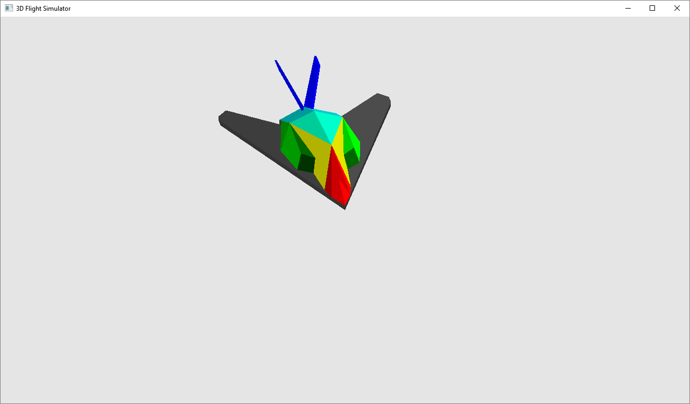
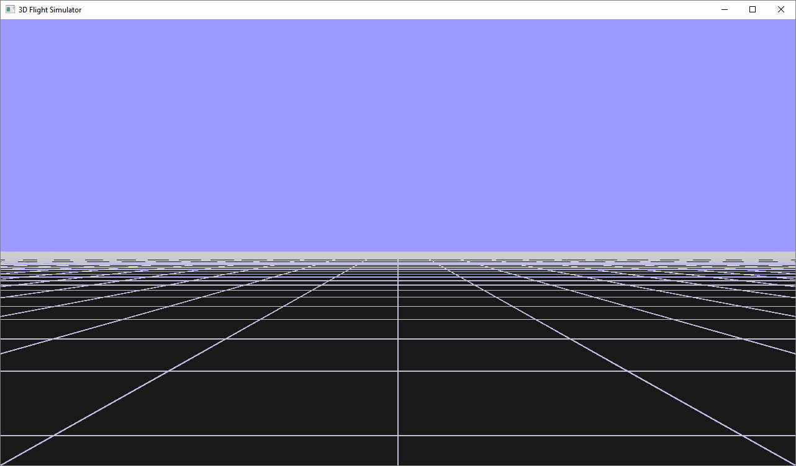

# OpenGL-FlightSimulator

- Model view(glOrtho)

- Simulation view(glPerspective)

## Control
- Keyboard callback
	- **A**: Roll left
	- **D**: Roll right
	- **W**: Pitch up
	- **S**: Pitch down
	- **Q**: Yaw left
	- **E**: Yaw right
	- **8**: Increase speed
	- **2**: Decrease speed
- Mouse callback
	- **Middle button**: Pause / Resume
- Motion callback
	- **Left button**: Rotate display in model view(glOrtho)
- Menu callback
	- **Right button**: Show menu
		- Change viewpoint (Model view <-> Simulation view)
		- Light on / off
		- Frame solid / wire
		- Simulation restart
		- Simulation end

## Feature
- Play sound while aircraft's speed is over than 0
- Stop simulator when aircraft goes out of the map
- Show effects(Font & Background) when simulator was stopped
